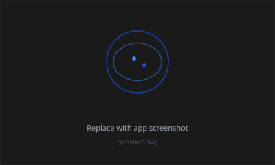
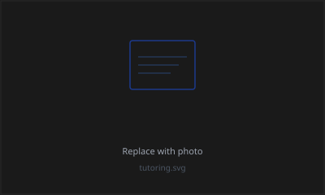
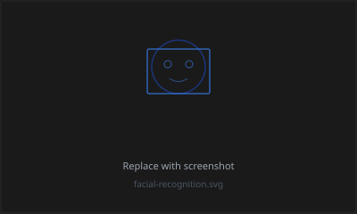
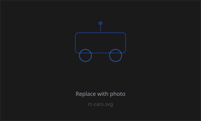
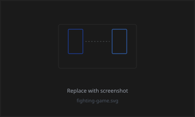
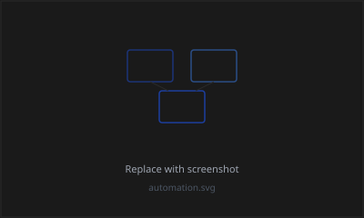
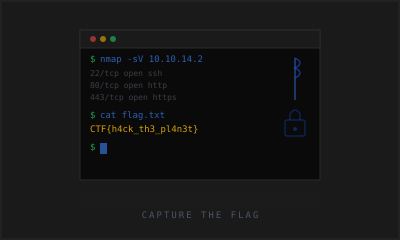
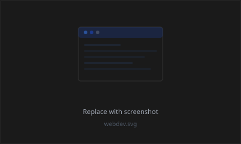

## GeoSnap

:::: {.project-card}
::: {.project-thumb}

:::
::: {.project-body}
### Co-Founder & CTO
A geography-based social platform. Built the full technical stack from concept to deployment, managing architecture decisions, development, and infrastructure.
:::
::::

## Freelance & Consulting

:::: {.project-card}
::: {.project-thumb}

:::
::: {.project-body}
### Freelance Tutoring
Private tutoring in computer science, mathematics, and programming for university and A-level students.
:::
::::

## Personal Projects

::: {.project-grid}

:::: {.project-card}
::: {.project-thumb}

:::
::: {.project-body}
### Facial Recognition System
Computer vision project implementing real-time face detection and recognition pipelines.
:::
::::

:::: {.project-card}
::: {.project-thumb}

:::
::: {.project-body}
### Autonomous RC Cars
Hardware/software project combining embedded systems with reinforcement learning for autonomous navigation.
:::
::::

:::: {.project-card}
::: {.project-thumb}

:::
::: {.project-body}
### Fighting Game
Game development project built from scratch, implementing physics, AI opponents, and multiplayer networking.
:::
::::

:::: {.project-card}
::: {.project-thumb}

:::
::: {.project-body}
### Automation Tools
Collection of workflow automation scripts and tools for productivity and system management.
:::
::::

:::: {.project-card}
::: {.project-thumb}

:::
::: {.project-body}
### CTF Challenges
Capture-the-flag security challenges — web exploitation, reverse engineering, and cryptography.
:::
::::

:::: {.project-card}
::: {.project-thumb}

:::
::: {.project-body}
### Web Development
Various full-stack web projects including personal sites and client work using modern frameworks.
:::
::::

:::
